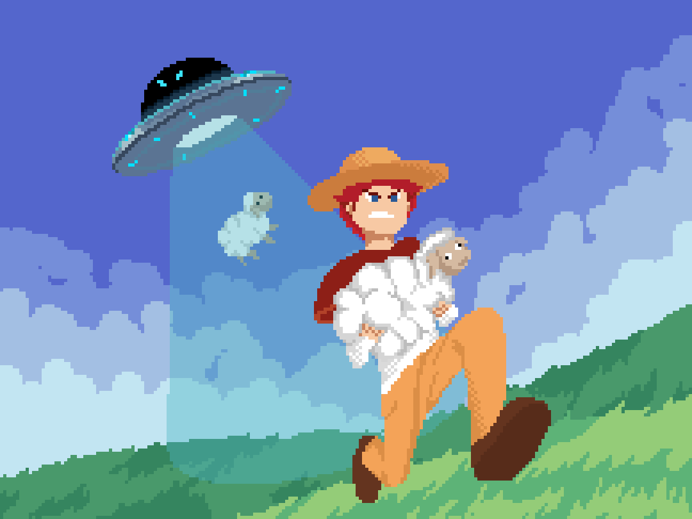
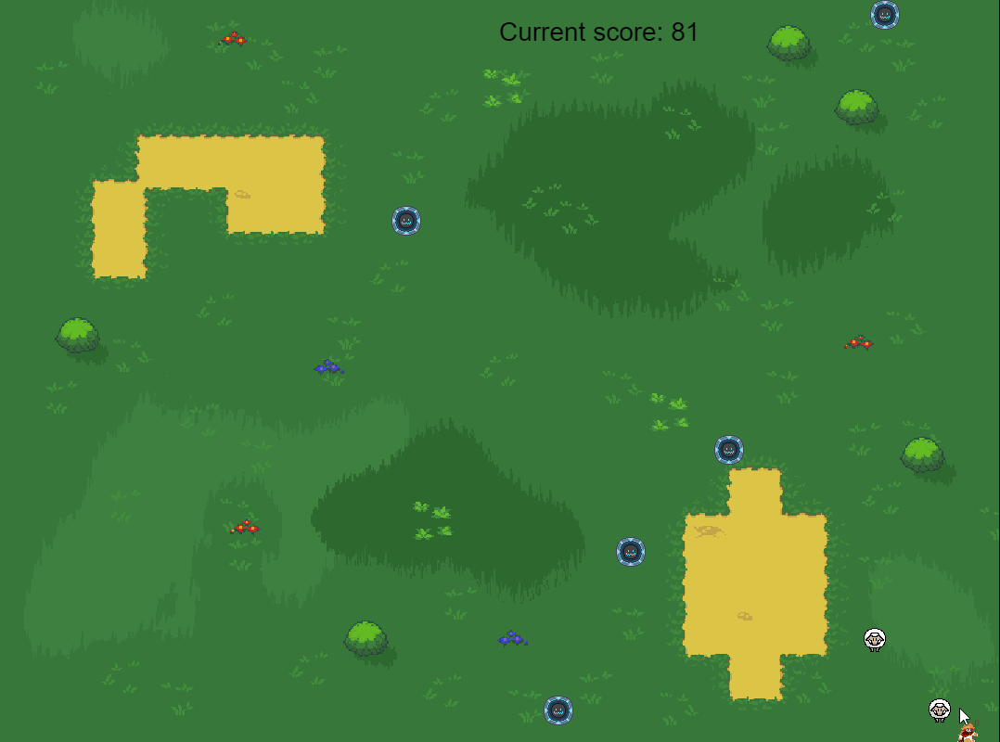

# Sheep Herder

Sheep Herder is our introductory Java course. The purpose of Sheep Herder is to allow students of any age to get their hands dirty, and understand the relationships that math and code share.

Sheep Herder may be a shorter course, but it's content dense. Sheep herder contains essential cartesian mathematics such as the distance between two points vector normalization. Moreover, Sheep Herder investigates concepts Object Oriented programming, Arrays, Lists, Linked-Lists and loops. Overall, these concepts will empower students to create bigger more complex creations, and better understand the importance of math.

# Learning Goals

Learning goals should be understood by students at the end of the classes

## General Code Skill
* Variables
* Functions
* Images
* Inputs
* If Statements
* For Loops (forward and reverse)
* Arrays, Lists and the concept of Linked Lists
* Converting English to Java

  

## Objected Oriented Programming
* Creating Objects
* Using Objects (Dot notation)

## Math
* Graphing (x and y)
* Circle Math (knowing terms like radius, and diamater)
* Creating Vectors (From A to B)
* Distance between two points 
* [Optional] Vector Normalization

# Course Outline
This course is broken down into 11 lessons. Each lesson should be completed in the span of one class, however, depending on student pacing,
a lesson can be up to three weeks long. Students who finish early can customize the game however they’d like with the instructor's help,
for instance, adding power ups, shrinking borders or a leaderboard! 

| Lesson | Topic                                      | Suggested Homework                  |
|--------|--------------------------------------------|-------------------------------------|
| 1      | Project Creation                           |                                     |
| 2      | Code Basics: Variables and Functions       | Try adding more shapes to the scene |
| 3      | Circles and Movement                       | Math Practice                       |
| 4      | Enemy Object and collision                 | Math Practice                       |
| 5      | Object Oriented Programming                | Add more Enemies                    |
| 6      | Arrays vs Lists and Linked Lists           |                                     |
| 7      | Core Gameplay                              | Think of customization ideas        |
| 8      | Game End                                   | Think of customization ideas        |
| 9      | Increasing Difficulty [Optional Challenge] |                                     |
| 10     | Shrinking Borders [Optional Challenge]     |                                     |
| 11     | Powerups [Optional Challenge]              |                                     |

# Instructional Method
Students participate in Live Virtual Sessions through a video program called Zoom.
These sessions are the primary form of learning, where an instructor guides the student
through the course material. Our class sizes are limited to a maximum of 4 students per
instructor and take place between 1-2 hours once per week at a scheduled time and
Day.

Students also have access to our online resources through RP4K’s Canvas Portal.
Extra material in the form of quizzes, discussions, assignments, and other materials are
provided for additional learning outside of the Live Virtual Sessions. Previous course
recordings are uploaded and students can participate in class discussions or contact the
instructor with any questions they may have.

# Additional Notes:
**Installation needs to happen before the course starts.**
Please ensure that the student has the template installed and to keep GitHub desktop installed in case students would like to work in groups. Follow the installation guide below to get started and reach out if you have any questions at [our email info@realprogramming.com](mailto:info@realprogramming.com)!

# Links
[Play the Game](https://flamingoezpz.github.io/Projects/Java/SheepHerder/SheepHerder.html)

[Installation and Setup guide](https://docs.google.com/document/d/1l68CybTafnAKsQsMTc5M8fqCZZZ0au7lIT8ssTyRpw0/edit?usp=sharing)

[Website](https://realprogramming.com/)